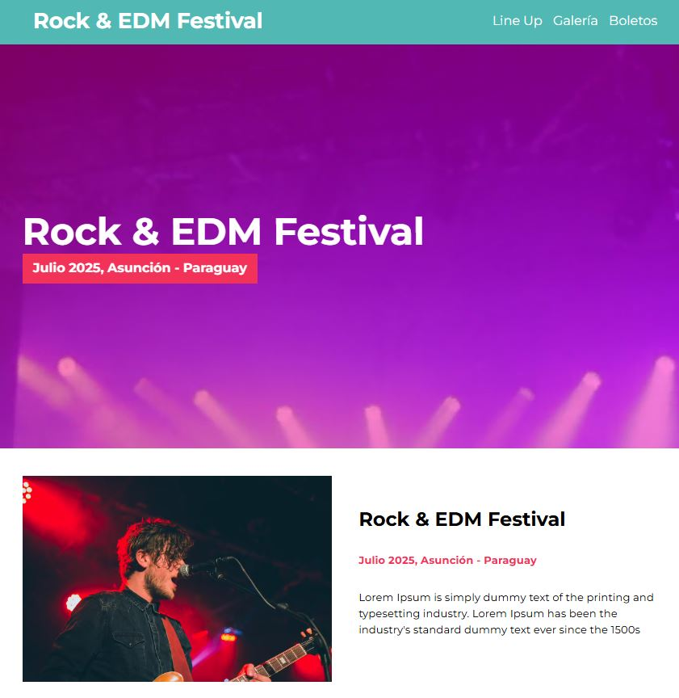
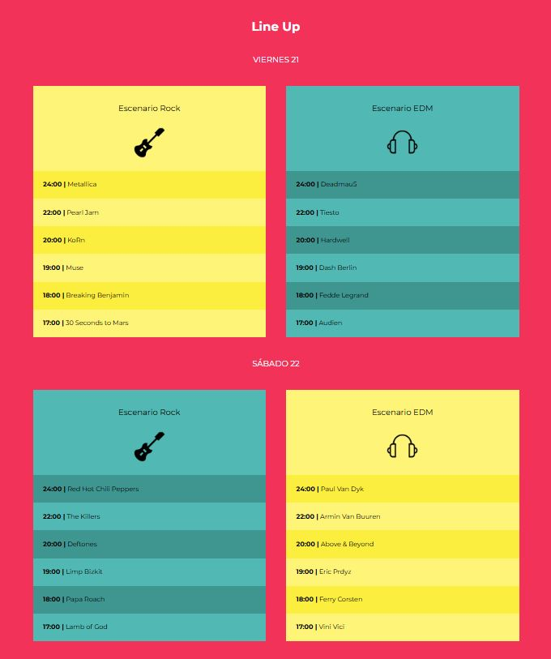
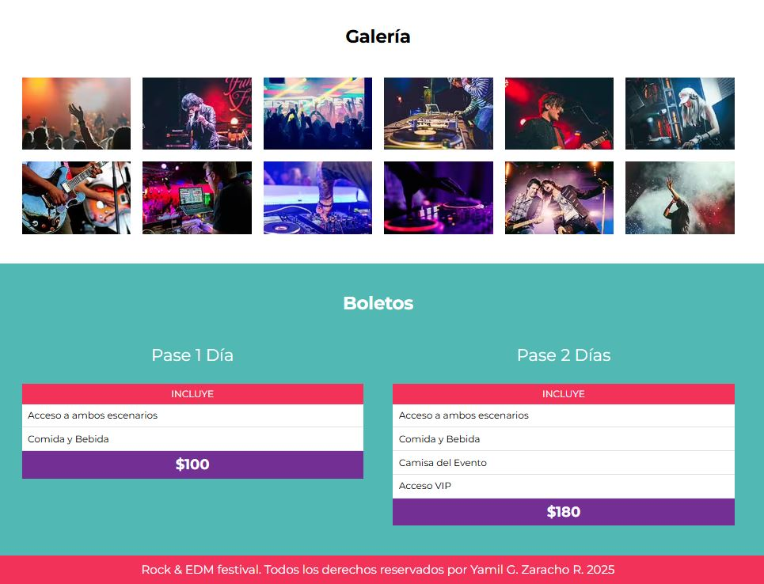

# 🎸 Festival Música – Rock & EMD 🎶

Este proyecto es una landing page moderna para un festival de música. Incluye información sobre los días del evento, el line-up de artistas, galería de conciertos anteriores, horarios y la opción de comprar boletos.

## 🌐 Funcionalidades

- Página principal con info del festival
- Galería de imágenes
- Line-up por día
- Compra de boletos
- Diseño responsivo

## 🛠️ Tecnologías utilizadas

- HTML5
- CSS3 + SASS
- JavaScript
- Gulp (automatización de tareas)
- Estructura modular de carpetas (`src`, `docs`)

## 📁 Estructura del proyecto
FestivalMusica/ ├── docs/ │ ├── css/ │ ├── img/ │ └── js/ ├── video/ ├── index.html ├── node_modules/ ├── src/ │ ├── img/ │ ├── js/ │ └── scss/ ├── gulpfile.js ├── package.json └── package-lock.json

## 📷 Capturas de pantalla

### Página de inicio

### Line-up

### Galería de fotos y boletos

## ▶️ Visualización del proyecto

1 - Clona este repositorio:
git clone https://github.com/YamilGZ/proyecto-festivalmusical.git
cd festival-musica

2 - Instala las dependencias:
npm install

3 - Ejecuta Gulp para compilar SASS y lanzar el servidor de desarrollo:
gulp

## 💡 Autor
    Desarrollado por Yamil G. Zaracho R. (YamilGZ).
